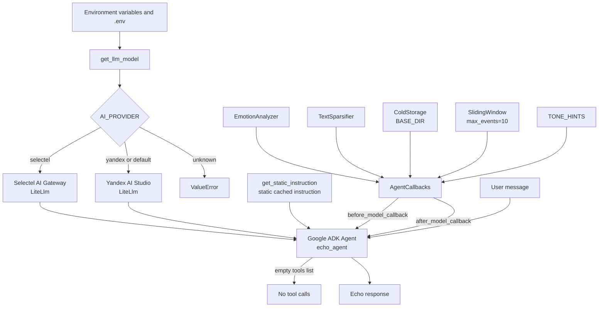

```mermaid
flowchart TD
    ENV[Environment variables and .env] --> CONFIG[get_llm_model]
    CONFIG --> SELECT{AI_PROVIDER}
    SELECT -->|selectel| SEL[Selectel AI Gateway\nLiteLlm]
    SELECT -->|yandex or default| YAN[Yandex AI Studio\nLiteLlm]
    SELECT -->|unknown| ERR[ValueError]

    ANALYZER[EmotionAnalyzer] --> CALLBACKS[AgentCallbacks]
    SPARSIFIER[TextSparsifier] --> CALLBACKS
    STORAGE[ColdStorage\nBASE_DIR] --> CALLBACKS
    WINDOW[SlidingWindow\nmax_events=10] --> CALLBACKS
    TONES[TONE_HINTS] --> CALLBACKS

    SEL --> AGENT[Google ADK Agent\necho_agent]
    YAN --> AGENT
    STATIC[get_static_instruction\nstatic cached instruction] --> AGENT
    CALLBACKS -->|before_model_callback| AGENT
    CALLBACKS -->|after_model_callback| AGENT
    AGENT -->|empty tools list| NO_TOOLS[No tool calls]

    USER[User message] --> AGENT
    AGENT --> RESPONSE[Echo response]
```
